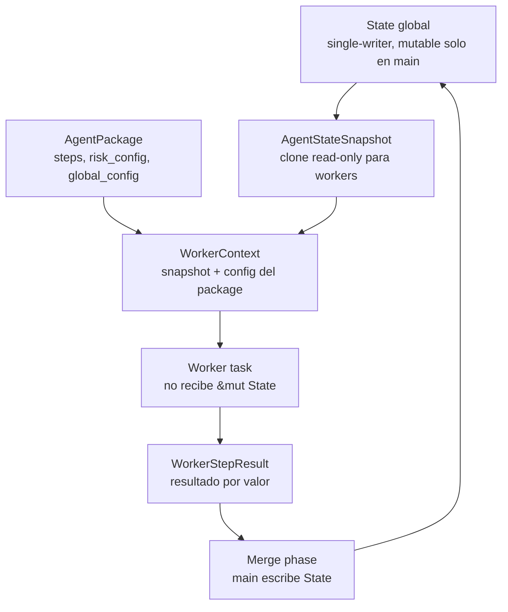
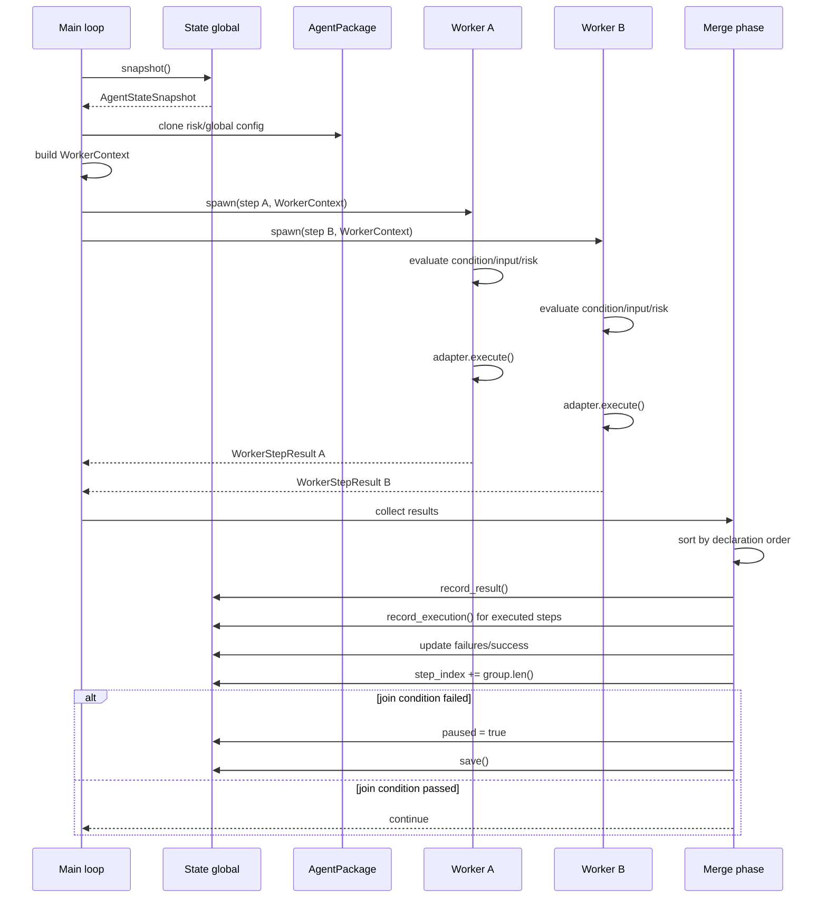

# State Thread-Safe - Refactor v0.10

Issue: #2 - State thread-safe para ejecucion paralela

## Objetivo

Preparar la frontera de estado antes de implementar `ParallelGroup`.
El MVP v0.9 funciona porque todo el loop tiene acceso exclusivo a
`&mut State`. En v0.10 los workers paralelos no pueden tocar ese estado
global: reciben una foto inmutable, ejecutan su step, y devuelven un
resultado para que el thread principal haga el merge.

La regla central:

> `State` sigue siendo single-writer. La concurrencia vive alrededor,
> nunca adentro del estado global.

## Correccion al boceto inicial

El boceto original ponia `global_config` y `risk_config` dentro de un
`AgentStateSnapshot`. En el codigo real esas configuraciones viven en
`AgentPackage`, no en `State`.

No vamos a mover config al estado. Eso mezclaria dos responsabilidades:

- `State`: que paso, donde quedo, que resultados existen.
- `AgentPackage`: que debe ejecutarse, con que riesgo y configuracion.

La frontera correcta queda asi:

```rust
AgentStateSnapshot   // solo campos clonados desde State
WorkerContext        // snapshot + configs clonadas desde AgentPackage
WorkerStepResult     // salida aislada de cada worker
```

## Capas de estado



## Estructuras nuevas

### `AgentStateSnapshot`

Vive en `src/state.rs`. Es una copia inmutable de lo que un worker puede
leer del estado.

```rust
#[derive(Debug, Clone)]
pub struct AgentStateSnapshot {
    pub agent_id: String,
    pub version: String,
    pub current_step: String,
    pub step_index: usize,
    pub consecutive_failures: u32,
    pub total_executions: u32,
    pub completed: bool,
    pub paused: bool,
    pub previous_results: HashMap<String, StepResult>,
}
```

Regla: no incluye `AgentGlobalConfig` ni `RiskConfig`.

### `WorkerContext`

Vive cerca del loop, inicialmente en `src/loop.rs` o en un modulo nuevo
cuando el archivo crezca. Es el paquete de lectura que recibe cada worker.

```rust
#[derive(Debug, Clone)]
pub struct WorkerContext {
    pub state: AgentStateSnapshot,
    pub global_config: AgentGlobalConfig,
    pub risk_config: RiskConfig,
}
```

### `WorkerStepResult`

El worker devuelve este valor. No necesita `Arc<Mutex<WorkerSlot>>` en
v0.10 porque `JoinSet` permite que cada task retorne su salida por valor.
Menos locks, menos superficie de carreras.

```rust
#[derive(Debug, Clone)]
pub struct WorkerStepResult {
    pub step_id: String,
    pub result: StepResult,
    pub execution_time_ms: u64,
    pub executed: bool,
}
```

### `ParallelSharedState`

Solo para senales compartidas que realmente necesitan coordinacion en
vivo: cancelacion y contador de fallos.

```rust
pub struct ParallelSharedState {
    pub cancel: AtomicBool,
    pub failures: AtomicU32,
    pub deadline: Instant,
}
```

## RiskContext

`RiskGate` hoy recibe `&State`. Para que un worker pueda evaluar riesgo
sin ver el estado mutable, se introduce un trait minimo:

```rust
pub trait RiskContext {
    fn consecutive_failures(&self) -> u32;
    fn total_executions(&self) -> u32;
    fn is_paused(&self) -> bool;
}
```

Implementaciones:

```rust
impl RiskContext for State {
    fn consecutive_failures(&self) -> u32 { self.consecutive_failures }
    fn total_executions(&self) -> u32 { self.total_executions }
    fn is_paused(&self) -> bool { self.paused }
}

impl RiskContext for AgentStateSnapshot {
    fn consecutive_failures(&self) -> u32 { self.consecutive_failures }
    fn total_executions(&self) -> u32 { self.total_executions }
    fn is_paused(&self) -> bool { self.paused }
}
```

Y `RiskGate` cambia a:

```rust
pub fn evaluate<C: RiskContext>(&self, capability: &str, context: &C) -> RiskDecision
```

Esto preserva el comportamiento secuencial y habilita workers read-only.

## Diagrama de secuencia



## Contrato de worker

El worker puede:

1. Leer `WorkerContext`.
2. Resolver input usando `snapshot.previous_results`.
3. Evaluar riesgo usando `RiskGate + AgentStateSnapshot`.
4. Resolver capability desde el registry.
5. Ejecutar adapter.
6. Retornar `WorkerStepResult`.
7. Incrementar contadores atomicos de `ParallelSharedState`.

El worker no puede:

1. Recibir `&mut State`.
2. Llamar `state.save()`.
3. Modificar `step_index`.
4. Escribir directamente en `State.results`.
5. Cambiar `paused` o `completed`.

## Contrato de merge

El thread principal:

1. Recoge todos los `WorkerStepResult`.
2. Ordena por orden declarativo del grupo, no por tiempo de finalizacion.
3. Evalua `JoinCondition`.
4. Escribe resultados en `State`.
5. Incrementa `total_executions` solo para steps realmente ejecutados.
6. Actualiza `consecutive_failures` de forma determinista.
7. Actualiza `step_index`.
8. Guarda snapshot si debe pausar.

## Por que no `Arc<Mutex<State>>`

`Arc<Mutex<State>>` parece simple, pero empuja la complejidad al peor
lugar: varios workers compitiendo por el estado global. Eso rompe la
propiedad mas valiosa del MVP: el estado se puede leer y auditar como una
linea de eventos clara.

Decision v0.10:

- No `Arc<Mutex<State>>`.
- No `DashMap` para `State.results`.
- No snapshots desde workers.
- Resultados paralelos se devuelven por valor y se mergean en main.

## Cambios de codigo planificados

### `src/state.rs`

- Agregar `AgentStateSnapshot`.
- Agregar `State::snapshot()`.
- Agregar `State::merge_results(results)`.
- Tests:
  - snapshot clona todos los campos esperados.
  - modificar `State.results` despues del snapshot no modifica el snapshot.
  - merge agrega resultados sin tocar step_index automaticamente.

### `src/risk.rs`

- Agregar `RiskContext`.
- Implementar `RiskContext` para `State`.
- Implementar `RiskContext` para `AgentStateSnapshot`.
- Cambiar `RiskGate::evaluate` para aceptar `RiskContext`.
- Tests actuales deben seguir pasando sin cambios semanticos.

### `src/loop.rs`

- Crear `WorkerContext`.
- Extraer ejecucion secuencial reusable:

```rust
async fn execute_step_once(
    step: &Step,
    context: &WorkerContext,
    registry: &CapabilityRegistry,
) -> WorkerStepResult
```

- El loop secuencial puede seguir mutando `State`, pero usa el mismo
  nucleo de ejecucion que usaran los workers.

## Tests planificados

| # | Test | Descripcion |
|---|------|-------------|
| 1 | `snapshot_copies_state_fields` | Snapshot contiene agent, version, counters y results |
| 2 | `snapshot_is_independent_clone` | Cambios posteriores en State no afectan snapshot |
| 3 | `risk_gate_accepts_snapshot` | RiskGate evalua `AgentStateSnapshot` igual que `State` |
| 4 | `merge_results_records_all_outputs` | Merge agrega todos los resultados esperados |
| 5 | `merge_does_not_advance_step_index` | La politica de avance queda en el loop principal |
| 6 | `worker_context_keeps_config_out_of_state` | Config del agente no se serializa como State |
| 7 | `sequential_tests_still_pass` | Los 31 tests existentes siguen verdes |

## Invariantes nuevas

1. `State` es single-writer.
2. `AgentStateSnapshot` es read-only por contrato.
3. `AgentPackage` sigue siendo la fuente de config.
4. Worker retorna datos, no efectos sobre `State`.
5. Merge es determinista y corre en main.
6. Snapshot a disco solo ocurre despues del merge.

## No entra en issue #2

- `ParallelGroup`.
- `JoinCondition`.
- `JoinSet`.
- Cancelacion real de tasks.
- Timeouts grupales.
- Dependencias nuevas.

Issue #2 solo prepara la frontera. Issue #3 implementa la ejecucion
paralela encima de esta base.

## Orden recomendado de implementacion

1. `AgentStateSnapshot` + tests.
2. `RiskContext` + tests.
3. `WorkerContext` + helper de ejecucion secuencial reusable.
4. Validar `cargo test`.
5. Recién despues abrir issue #3 para `ParallelGroup`.
